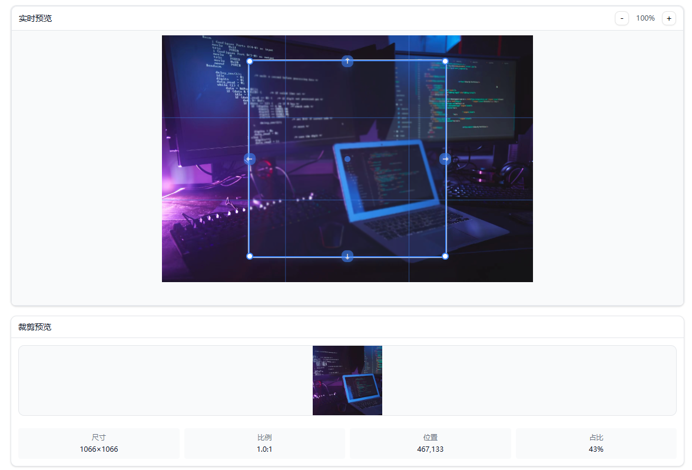
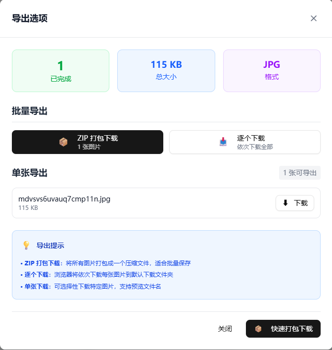

<div align="center">

# 🎨 Cropify

<!-- Header Banner -->


## Professional Batch Image Cropping Tool

<p align="center">
  <strong>🚀 A modern, powerful, and user-friendly batch image cropping tool built with Next.js 15 and React 19</strong>
</p>

<!-- Badges -->
<p align="center">
  
  
  
  
  
  
</p>

<!-- Key Features Highlight -->
<p align="center">
  
  
  
  
</p>

<!-- Navigation Links -->
<p align="center">
  <a href="./README.zh.md">
    
  </a>
  <a href="#">
    
  </a>
  <a href="#">
    
  </a>
  <a href="#">
    
  </a>
</p>

<!-- Quick Start CTA -->
<p align="center">
  <a href="https://cropifypro.vercel.app">
    
  </a>
</p>

<!-- Screenshot/Demo Section -->
<br>

<table align="center">
  <tr>
    <td align="center" width="50%">
      
      <br>
      <sub><b>🎯 Intuitive Empty State Interface</b></sub>
    </td>
    <td align="center" width="50%">
      
      <br>
      <sub><b>⚡ Powerful Batch Processing Workflow</b></sub>
    </td>
  </tr>
  <tr>
    <td align="center" width="50%">
      
      <br>
      <sub><b>👁️ Real-time Preview and Precise Control</b></sub>
    </td>
    <td align="center" width="50%">
      
      <br>
      <sub><b>📦 Flexible Export and Download Options</b></sub>
    </td>
  </tr>
</table>

<!-- Feature Highlights -->
<br>

<details>
<summary><b>🌟 Core Feature Highlights (Click to expand)</b></summary>
<br>

<table>
  <tr>
    <td align="center" width="25%">
      
      <br>
      <sub>100% Local Processing<br>Data Never Leaves Device</sub>
    </td>
    <td align="center" width="25%">
      
      <br>
      <sub>Canvas API Optimized<br>Hardware Accelerated</sub>
    </td>
    <td align="center" width="25%">
      
      <br>
      <sub>9-Point Anchor System<br>Precise Crop Control</sub>
    </td>
    <td align="center" width="25%">
      
      <br>
      <sub>Mobile Friendly<br>Desktop Optimized</sub>
    </td>
  </tr>
</table>

</details>

---

</div>

## 🎯 What Makes Cropify Special?

Cropify stands out as a comprehensive, client-side image processing solution that prioritizes **privacy, performance, and professional-grade functionality**:

- **🔐 Complete Privacy**: All processing happens locally in your browser - your images never leave your device
- **⚡ Lightning Fast**: Optimized Canvas API processing with efficient memory management
- **🎛️ Professional Controls**: Advanced cropping options rivaling desktop software
- **📱 Modern UI/UX**: Built with the latest web technologies for a smooth experience
- **🔄 Batch Intelligence**: Smart queue management and progress tracking for large batches

## ✨ Core Features

### 🖼️ Image Management
- **Multiple Import Methods**: Drag & drop, click to select, clipboard paste
- **Format Support**: JPEG, PNG, WebP, BMP, TIFF, GIF
- **Batch Processing**: Handle up to 100 images simultaneously
- **Smart Validation**: File format and size validation with detailed error messages

### ✂️ Advanced Cropping System
- **Intelligent Cropping**: Manual adjustment with real-time preview and visual feedback
- **Smart Preset Sizes**:
  - **Photo ID**: 1-inch (25×35mm), 2-inch (35×49mm), ID card (26×32mm)
  - **Social Media**: WeChat cover (900×833px), profile pics (200×200px), stories (1080×1920px)
  - **Print Ready**: A4 (210×297mm), custom print dimensions
  - **Wallpapers**: Desktop (1920×1080px), mobile (1080×1920px)
  - **E-commerce**: Square (800×800px), product shots (3:4 ratio)
- **9-Point Anchor System**: Precise positioning with TOP_LEFT, CENTER, BOTTOM_RIGHT controls
- **Advanced Transformations**:
  - Rotation (0-360° with fine control)
  - Horizontal/Vertical flipping
  - Rounded corner cropping with adjustable radius
  - Aspect ratio locking/unlocking

### 🎨 Enhanced User Experience
- **Real-time Preview System**: Instant before/after comparison with seamless updates
- **Advanced Zoom Controls**: 25% to 400% zoom with smooth scaling and pan navigation
- **Smart Grid Overlays**: Rule of thirds, golden ratio, and custom grid guidelines
- **Responsive Design**: Optimized for desktop workflow, tablet-friendly, mobile-accessible
- **Clean Interface**: Modern, distraction-free UI focused on productivity
- **Keyboard Shortcuts**: Ctrl+V paste, Delete remove, Escape cancel operations

### ⚙️ Professional Quality Control
- **Multi-format Output**: JPG (universal compatibility), PNG (lossless), WebP (modern efficiency)
- **Smart Compression**:
  - JPG: Quality levels 1-100% with real-time size estimation
  - PNG: Compression levels 0-9 for optimal balance
  - WebP: Advanced compression with superior quality-to-size ratio
- **Metadata Management**: Optional EXIF data preservation or removal
- **File Size Optimization**: Real-time size estimation and compression previews

### 📦 Flexible Export System
- **Individual Downloads**: Instant single image download as processed
- **Sequential Batch Export**: Automated download of all processed images with progress tracking
- **ZIP Archive Creation**: Compressed bundle for easy sharing and storage
- **Smart Filename Generation**:
  - Preserve original names or apply custom patterns
  - Automatic conflict resolution
  - Customizable prefixes and suffixes

### 🚀 Enterprise-Grade Performance
- **100% Client-Side Processing**: Zero server dependency, complete data privacy
- **Advanced Memory Management**:
  - Smart garbage collection for large image batches
  - Efficient Canvas buffer handling
  - Memory usage monitoring with warnings
- **Optimized Batch Processing**:
  - Background processing with Web Workers
  - Queue-based task management
  - Intelligent progress tracking and error recovery
- **Hardware Acceleration**: Canvas API optimization for GPU-accelerated operations

## 🛠️ Modern Technology Stack

<div align="center">

<table>
  <tr>
    <th align="center">🚀 Core Framework</th>
    <th align="center">🎨 Styling & UI</th>
    <th align="center">🖼️ Image Processing</th>
    <th align="center">⚙️ Build Tools</th>
  </tr>
  <tr>
    <td align="center">
      <br>
      <br>
      
    </td>
    <td align="center">
      <br>
      <br>
      
    </td>
    <td align="center">
      <br>
      <br>
      
    </td>
    <td align="center">
      <br>
      <br>
      
    </td>
  </tr>
</table>

</div>

### 🔧 Technical Features

- **⚡ Next.js 15.4.2**: Latest App Router with Turbopack for blazing-fast development speed
- **🔄 React 19.1.0**: Cutting-edge React with concurrent features and improved performance
- **🛡️ TypeScript 5.x**: Complete type safety and advanced type inference
- **🎨 Tailwind CSS 4**: Utility-first CSS with latest features and optimizations
- **🖼️ Canvas API**: Hardware-accelerated image operations and efficient processing
- **📦 Turbopack**: Next-generation bundler for instant reloads and optimized builds

## 🚀 Quick Start

<div align="center">

### 📋 System Requirements

<table>
  <tr>
    <td align="center">
      
    </td>
    <td align="center">
      
    </td>
    <td align="center">
      
    </td>
  </tr>
</table>

</div>

### Installation

1. **Clone the repository**
   ```bash
   git clone https://github.com/yourusername/cropify.git
   cd cropify
   ```

2. **Install dependencies**
   ```bash
   npm install
   # or
   yarn install
   # or
   pnpm install
   ```

3. **Start development server**
   ```bash
   npm run dev
   # or
   yarn dev
   # or
   pnpm dev
   ```

4. **Open your browser**

   Navigate to [http://localhost:3000](http://localhost:3000)

### Production Build

```bash
# Build for production
npm run build

# Start production server
npm start
```

## 📖 Usage Guide

### Basic Workflow

1. **Import Images**
   - Drag and drop image files onto the upload area
   - Click "Select Files" to browse your computer
   - Paste images from clipboard (Ctrl+V / Cmd+V)

2. **Configure Cropping**
   - Select an image from the list to start editing
   - Choose from preset sizes or set custom dimensions
   - Adjust crop area by dragging corners or using position controls
   - Apply transformations (rotate, flip) as needed

3. **Quality Settings**
   - Select output format (JPG, PNG, WebP)
   - Adjust compression quality for optimal file size
   - Preview estimated output size

4. **Batch Processing**
   - Click "Start Batch" to process all images with current settings
   - Monitor progress in real-time
   - Pause or cancel processing at any time

5. **Export Results**
   - Download individual images as they're processed
   - Export all images at once
   - Create ZIP archive for batch download

### Advanced Features

#### Custom Preset Sizes
Create your own preset sizes by modifying the configuration in `src/constants/index.ts`:

```typescript
export const PRESET_SIZES: PresetSize[] = [
  { name: 'Custom Size', width: 800, height: 600, unit: 'px', category: 'Custom' },
  // Add more presets...
];
```

#### Keyboard Shortcuts
- `Ctrl+V` / `Cmd+V`: Paste image from clipboard
- `Delete`: Remove selected image
- `Escape`: Cancel current operation

## 🏗️ Project Structure

```
cropify/
├── src/
│   ├── app/                 # Next.js App Router
│   ├── components/          # React components
│   │   ├── ui/             # Reusable UI components
│   │   └── modules/        # Feature-specific components
│   ├── hooks/              # Custom React hooks
│   ├── types/              # TypeScript type definitions
│   ├── utils/              # Utility functions
│   └── constants/          # Application constants
├── public/                 # Static assets
├── docs/                   # Documentation
└── package.json
```

## 🔧 Configuration

### Environment Variables

Create a `.env.local` file in the root directory:

```env
# Optional: Add custom configuration
NEXT_PUBLIC_APP_NAME=Cropify
NEXT_PUBLIC_MAX_FILE_SIZE=10
```

### Customization

- **Supported Formats**: Modify `SUPPORTED_INPUT_FORMATS` in `src/constants/index.ts`
- **Max File Size**: Adjust `MAX_FILE_SIZE` limit
- **Preset Sizes**: Add or modify preset dimensions
- **UI Theme**: Customize Tailwind CSS configuration

## 🤝 Contributing

We welcome contributions! Please see our [Contributing Guide](CONTRIBUTING.md) for details.

### Development Setup

1. Fork the repository
2. Create a feature branch: `git checkout -b feature/amazing-feature`
3. Make your changes
4. Run tests: `npm test`
5. Commit changes: `git commit -m 'Add amazing feature'`
6. Push to branch: `git push origin feature/amazing-feature`
7. Open a Pull Request

## 📄 License

This project is licensed under the MIT License - see the [LICENSE](LICENSE) file for details.

## 🙏 Acknowledgments

- [Next.js](https://nextjs.org/) - The React framework for production
- [Tailwind CSS](https://tailwindcss.com/) - Utility-first CSS framework
- [JSZip](https://stuk.github.io/jszip/) - JavaScript library for creating ZIP files
- [Canvas API](https://developer.mozilla.org/en-US/docs/Web/API/Canvas_API) - For image processing

## 📞 Support

- 📧 Email: yaolifeng666@gmail.com
- 🐛 [Report Issues](https://github.com/yourusername/cropify/issues)
- 💡 [Feature Requests](https://github.com/yourusername/cropify/discussions)
- 📖 [Documentation](https://cropify.github.io/docs)

## 🔮 Roadmap

- [ ] WebAssembly integration for faster processing
- [ ] Advanced filters and effects
- [ ] Cloud storage integration
- [ ] Team collaboration features
- [ ] API for developers
- [ ] Mobile app version

---

<div align="center">

### 🌟 Star History


**🎨 Made with ❤️ by the <a href="https://yaolifeng.com">Cropify</a> Team**

<sub>© 2024 Cropify. All rights reserved.</sub>

</div>
