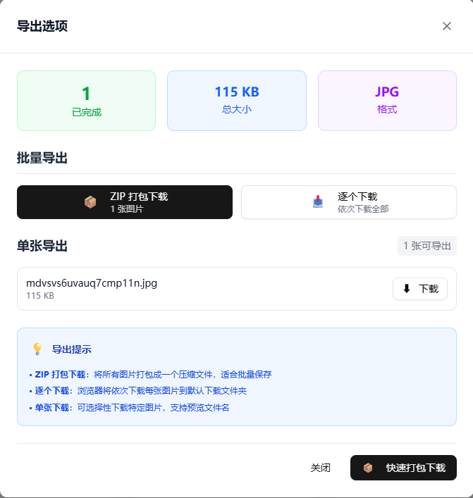

<div align="center">

# 🎨 Cropify

<!-- Header Banner -->


## 专业批量图片裁剪工具

<p align="center">
  <strong>🚀 基于 Next.js 15 和 React 19 构建的现代化、功能强大且用户友好的批量图片裁剪工具</strong>
</p>

<!-- Badges -->
<p align="center">
  
  
  
  
  
  
</p>

<!-- Key Features Highlight -->
<p align="center">
  
  
  
  
</p>

<!-- Navigation Links -->
<p align="center">
  <a href="./README.md">
    
  </a>
  <a href="#">
    
  </a>
  <a href="#">
    
  </a>
  <a href="#">
    
  </a>
</p>

<!-- Stats -->
<!-- <p align="center">
  
  
  
  
</p> -->

<!-- Quick Start CTA -->
<p align="center">
  <a href="https://cropifypro.vercel.app/">
    
  </a>
</p>

<!-- Screenshot/Demo Section -->
<br>

<table align="center">
  <tr>
    <td align="center" width="50%">
      
      <br>
      <sub><b>🎯 直观的空状态引导界面</b></sub>
    </td>
    <td align="center" width="50%">
      
      <br>
      <sub><b>⚡ 强大的批量处理工作流</b></sub>
    </td>
  </tr>
  <tr>
    <td align="center" width="50%">
      
      <br>
      <sub><b>👁️ 实时预览和精确控制</b></sub>
    </td>
    <td align="center" width="50%">
      
      <br>
      <sub><b>📦 灵活的导出和下载选项</b></sub>
    </td>
  </tr>
</table>

<!-- Feature Highlights -->
<br>

<details>
<summary><b>🌟 核心功能亮点 (点击展开)</b></summary>
<br>

<table>
  <tr>
    <td align="center" width="25%">
      
      <br>
      <sub>100% 本地处理<br>数据永不离开设备</sub>
    </td>
    <td align="center" width="25%">
      
      <br>
      <sub>Canvas API 优化<br>硬件加速处理</sub>
    </td>
    <td align="center" width="25%">
      
      <br>
      <sub>九点锚定系统<br>精确裁剪控制</sub>
    </td>
    <td align="center" width="25%">
      
      <br>
      <sub>移动端友好<br>桌面端优化</sub>
    </td>
  </tr>
</table>

</details>

---

</div>

## 🎯 Cropify 的独特优势

Cropify 作为一个综合性的客户端图像处理解决方案，专注于**隐私保护、高性能和专业级功能**：

- **🔐 完全隐私保护**：所有处理都在浏览器本地进行 - 您的图片永远不会离开设备
- **⚡ 闪电般快速**：优化的 Canvas API 处理和高效的内存管理
- **🎛️ 专业级控制**：媲美桌面软件的高级裁剪选项
- **📱 现代化界面**：采用最新网络技术构建，提供流畅体验
- **🔄 智能批处理**：针对大批量处理的智能队列管理和进度跟踪

## ✨ 核心功能

### 🖼️ 图片管理
- **多种导入方式**：拖拽上传、点击选择、剪贴板粘贴
- **格式支持**：JPEG、PNG、WebP、BMP、TIFF、GIF
- **批量处理**：同时处理多达 100 张图片
- **智能验证**：文件格式和大小验证，提供详细错误信息

### ✂️ 高级裁剪系统
- **智能裁剪**：手动调整配合实时预览和可视化反馈
- **智能预设尺寸**：
  - **证件照**：一寸照 (25×35mm)、二寸照 (35×49mm)、身份证照 (26×32mm)
  - **社交媒体**：微信封面 (900×833px)、头像 (200×200px)、朋友圈 (1080×1920px)
  - **打印就绪**：A4 (210×297mm)、自定义打印尺寸
  - **壁纸**：桌面 (1920×1080px)、手机 (1080×1920px)
  - **电商**：方图 (800×800px)、产品图 (3:4 比例)
- **九点锚定系统**：精确定位控制，支持 TOP_LEFT、CENTER、BOTTOM_RIGHT 等
- **高级变换功能**：
  - 旋转 (0-360° 精细控制)
  - 水平/垂直翻转
  - 圆角裁剪，可调节圆角半径
  - 宽高比锁定/解锁

### 🎨 增强用户体验
- **实时预览系统**：即时的前后对比，无缝更新
- **高级缩放控制**：25% 到 400% 缩放，支持平滑缩放和平移导航
- **智能网格叠加**：三分法则、黄金比例和自定义网格辅助线
- **响应式设计**：桌面工作流优化，平板友好，移动端可访问
- **简洁界面**：专注于生产力的现代化、无干扰用户界面
- **键盘快捷键**：Ctrl+V 粘贴、Delete 删除、Escape 取消操作

### ⚙️ 专业质量控制
- **多格式输出**：JPG (通用兼容性)、PNG (无损)、WebP (现代高效)
- **智能压缩**：
  - JPG：质量级别 1-100%，实时大小估算
  - PNG：压缩级别 0-9，最佳平衡
  - WebP：高级压缩，卓越的质量与大小比
- **元数据管理**：可选的 EXIF 数据保留或移除
- **文件大小优化**：实时大小估算和压缩预览

### 📦 灵活导出系统
- **单张下载**：处理完成后立即下载单张图片
- **批量顺序导出**：自动下载所有处理图片，带进度跟踪
- **ZIP 归档创建**：压缩包便于分享和存储
- **智能文件命名**：
  - 保留原始名称或应用自定义模式
  - 自动冲突解决
  - 可自定义前缀和后缀

### 🚀 企业级性能
- **100% 客户端处理**：零服务器依赖，完全数据隐私
- **高级内存管理**：
  - 大图片批处理的智能垃圾回收
  - 高效的 Canvas 缓冲区处理
  - 内存使用监控和警告
- **优化批处理**：
  - Web Workers 后台处理
  - 基于队列的任务管理
  - 智能进度跟踪和错误恢复
- **硬件加速**：针对 GPU 加速操作的 Canvas API 优化

## 🛠️ 现代技术栈

<div align="center">

<table>
  <tr>
    <th align="center">🚀 核心框架</th>
    <th align="center">🎨 样式与UI</th>
    <th align="center">🖼️ 图像处理</th>
    <th align="center">⚙️ 构建工具</th>
  </tr>
  <tr>
    <td align="center">
      <br>
      <br>
      
    </td>
    <td align="center">
      <br>
      <br>
      
    </td>
    <td align="center">
      <br>
      <br>
      
    </td>
    <td align="center">
      <br>
      <br>
      
    </td>
  </tr>
</table>

</div>

### 🔧 技术特性

- **⚡ Next.js 15.4.2**：最新的 App Router 配合 Turbopack，实现超快开发速度
- **🔄 React 19.1.0**：前沿的 React，具备并发特性和改进的性能
- **🛡️ TypeScript 5.x**：完整类型安全和高级类型推断
- **🎨 Tailwind CSS 4**：实用优先的 CSS，包含最新功能和优化
- **🖼️ Canvas API**：硬件加速的图像操作和高效处理
- **📦 Turbopack**：下一代打包器，实现即时重载和优化构建

## 🚀 快速开始

<div align="center">

### 📋 系统要求

<table>
  <tr>
    <td align="center">
      
    </td>
    <td align="center">
      
    </td>
    <td align="center">
      
    </td>
  </tr>
</table>

</div>

## 📖 使用指南

### 基本工作流程

1. **导入图片**
   - 将图片文件拖拽到上传区域
   - 点击"选择文件"浏览您的计算机
   - 从剪贴板粘贴图片 (Ctrl+V / Cmd+V)

2. **配置裁剪**
   - 从列表中选择图片开始编辑
   - 从预设尺寸中选择或设置自定义尺寸
   - 通过拖拽角落或使用位置控制调整裁剪区域
   - 根据需要应用变换（旋转、翻转）

3. **质量设置**
   - 选择输出格式 (JPG、PNG、WebP)
   - 调整压缩质量以获得最佳文件大小
   - 预览估算的输出大小

4. **批量处理**
   - 点击"开始批处理"使用当前设置处理所有图片
   - 实时监控进度
   - 随时暂停或取消处理

5. **导出结果**
   - 处理完成后下载单张图片
   - 一次性导出所有图片
   - 创建 ZIP 归档进行批量下载

### 高级功能

#### 自定义预设尺寸
通过修改 `src/constants/index.ts` 中的配置来创建您自己的预设尺寸：

```typescript
export const PRESET_SIZES: PresetSize[] = [
  { name: '自定义尺寸', width: 800, height: 600, unit: 'px', category: '自定义' },
  // 添加更多预设...
];
```

#### 键盘快捷键
- `Ctrl+V` / `Cmd+V`：从剪贴板粘贴图片
- `Delete`：删除选中的图片
- `Escape`：取消当前操作

## 🏗️ 项目结构

```
cropify/
├── src/
│   ├── app/                 # Next.js App Router
│   ├── components/          # React 组件
│   │   ├── ui/             # 可复用 UI 组件
│   │   └── modules/        # 功能特定组件
│   ├── hooks/              # 自定义 React hooks
│   ├── types/              # TypeScript 类型定义
│   ├── utils/              # 工具函数
│   └── constants/          # 应用常量
├── public/                 # 静态资源
├── docs/                   # 文档
└── package.json
```

## 🔧 配置

### 环境变量

在根目录创建 `.env.local` 文件：

```env
# 可选：添加自定义配置
NEXT_PUBLIC_APP_NAME=Cropify
NEXT_PUBLIC_MAX_FILE_SIZE=10
```

### 自定义设置

- **支持的格式**：在 `src/constants/index.ts` 中修改 `SUPPORTED_INPUT_FORMATS`
- **最大文件大小**：调整 `MAX_FILE_SIZE` 限制
- **预设尺寸**：添加或修改预设尺寸
- **界面主题**：自定义 Tailwind CSS 配置

## 🤝 贡献

我们欢迎贡献！请查看我们的[贡献指南](CONTRIBUTING.md)了解详情。

### 开发设置

1. Fork 仓库
2. 创建功能分支：`git checkout -b feature/amazing-feature`
3. 进行更改
4. 运行测试：`npm test`
5. 提交更改：`git commit -m 'Add amazing feature'`
6. 推送到分支：`git push origin feature/amazing-feature`
7. 开启 Pull Request

## 📄 许可证

本项目使用 MIT 许可证 - 查看 [LICENSE](LICENSE) 文件了解详情。

## 🙏 致谢

- [Next.js](https://nextjs.org/) - 用于生产的 React 框架
- [Tailwind CSS](https://tailwindcss.com/) - 实用优先的 CSS 框架
- [JSZip](https://stuk.github.io/jszip/) - 用于创建 ZIP 文件的 JavaScript 库
- [Canvas API](https://developer.mozilla.org/en-US/docs/Web/API/Canvas_API) - 用于图像处理

## 📞 支持

- 📧 邮箱：yaolifeng666@gmail.com
- 🐛 [报告问题](https://github.com/yourusername/cropify/issues)
- 💡 [功能建议](https://github.com/yourusername/cropify/discussions)
- 📖 [文档](https://cropify.github.io/docs)
---

<div align="center">

### 🌟 Star 历史


**🎨 由 <a href="https://yaolifeng.com">Cropify</a> 团队用 ❤️ 制作**

<sub>© 2024 Cropify. 保留所有权利。</sub>

</div>
